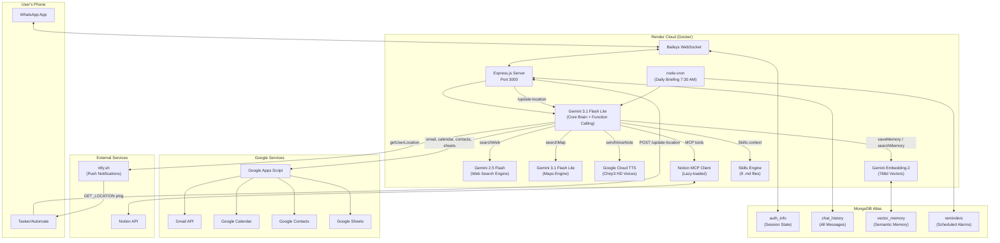
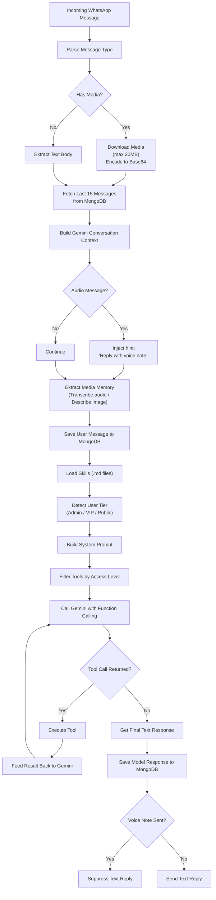

<p align="center">
  <h1 align="center">Rhea - WhatsApp AI Avatar & Personal Assistant</h1>
  <p align="center">
    <em>A multi-model agentic AI system that acts as a personal avatar and autonomous assistant on WhatsApp.</em>
  </p>
  <p align="center">
    
    
    
    
    
    
  </p>
</p>

---

## What is Rhea?

**Rhea** is a fully autonomous WhatsApp AI assistant deployed on Render. It functions as a personal AI avatar for its creator - handling conversations in natural Minglish (Marathi + English), executing complex multi-step tasks through function calling, and integrating with 7+ external services - all through WhatsApp.

It features a **3-tier access control system** (Admin / VIP / Public), a **custom function-calling loop** with 21+ tools, **long-term semantic memory** via vector embeddings, and a **multi-model AI architecture** that optimizes for both speed and capability.

### Key Capabilities

| Feature | Description |
|---|---|
| **Conversational AI** | Natural Minglish conversations with context-aware responses |
| **Voice Notes** | Generates and sends synthesized voice messages (Google Cloud TTS - Chirp3 HD) |
| **Web Search** | Live internet search with Google Search grounding |
| **Maps & Location** | Real-time GPS location, traffic info, nearby places discovery |
| **Daily Briefing** | Automated 7:30 AM briefing with weather, news, and pending reminders |
| **Long-Term Memory** | Semantic vector memory that persists across conversations |
| **Email** | Send emails via Gmail |
| **Calendar** | Create Google Calendar events |
| **Google Sheets** | Full CRUD operations on spreadsheets |
| **Contacts** | Search Google Contacts by name |
| **Reminders & Alarms** | Schedule, list, and manage timed reminders |
| **Chat History** | Read past conversations with any contact |
| **Notion Integration** | Read/write Notion pages and databases via MCP |
| **Media Understanding** | Process images, videos, audio, documents with AI descriptions |
| **WhatsApp Messaging** | Send messages to any contact on behalf of admin |

---

## Architecture



---

## Multi-Model AI Strategy

Rhea uses a deliberate multi-model architecture where each Gemini model is chosen for its specific strengths:

| Model | Role | Why? |
|---|---|---|
| `gemini-3.1-flash-lite` | Core brain, media processing, maps | Ultra-fast, low-latency, sufficient for conversation |
| `gemini-2.5-flash` | Web search, briefing data | Supports Google Search grounding tool |
| `gemini-embedding-2` | Vector memory (768d) | Semantic similarity search for long-term memory |

---

## Tech Stack

### Core Runtime
| Technology | Purpose |
|---|---|
| **TypeScript** | Primary language |
| **Node.js 20** | Runtime (Docker: `node:20-slim`) |
| **Express.js 5** | HTTP server for API endpoints |
| **Baileys** | Unofficial WhatsApp Web API (lightweight, no Chromium) |

### AI & ML
| Technology | Purpose |
|---|---|
| **Google Gemini 3.1 Flash Lite** | Core conversational brain + function calling |
| **Google Gemini 2.5 Flash** | Web search engine (Google Search grounding) |
| **Google Gemini Embedding-2** | 768-dimensional text embeddings for vector memory |
| **Google Cloud TTS v1beta1** | Voice note synthesis (Chirp3 HD, OGG_OPUS) |

### Data & Storage
| Technology | Purpose |
|---|---|
| **MongoDB Atlas** | Auth state, chat history, reminders, vector memory |
| **MongoDB `$vectorSearch`** | Semantic similarity search on memory embeddings |

### Integrations
| Technology | Purpose |
|---|---|
| **Google Apps Script** | Serverless bridge for Gmail, Calendar, Contacts, Sheets |
| **Notion MCP Server** | Model Context Protocol integration for Notion workspace |
| **ntfy.sh** | Push notification service for phone GPS pinging |
| **Tasker/Automate** | Android app that responds to pings with GPS coordinates |

---

## Complete Tool Reference (21+ Tools)

| # | Tool | Description | Admin | VIP | Public |
|---|---|---|:---:|:---:|:---:|
| 1 | `sendVoiceNote` | Send synthesized voice message | Yes | Yes | - |
| 2 | `setReminder` | Schedule a timed reminder | Yes | Yes | Yes |
| 3 | `listReminders` | View all active reminders | Yes | Yes | Yes |
| 4 | `deleteReminder` | Cancel a reminder by ID | Yes | Yes | Yes |
| 5 | `searchWeb` | Live Google Search | Yes | Yes | - |
| 6 | `searchMap` | Google Maps search | Yes | Yes | - |
| 7 | `getUserLocation` | Ping phone for GPS coordinates | Yes | Yes | - |
| 8 | `messageAdmin` | Send message/voice to admin | - | Yes | - |
| 9 | `sendEmail` | Send email via Gmail | Yes | - | - |
| 10 | `createCalendarEvent` | Create Google Calendar event | Yes | - | - |
| 11 | `searchGoogleContact` | Search Google Contacts | Yes | - | - |
| 12 | `sendWhatsAppMessage` | Send WhatsApp message to anyone | Yes | - | - |
| 13 | `findGoogleSheet` | Search Google Drive for sheets | Yes | - | - |
| 14 | `createGoogleSheet` | Create new spreadsheet | Yes | - | - |
| 15 | `readGoogleSheet` | Read data from spreadsheet | Yes | - | - |
| 16 | `appendGoogleSheet` | Append rows to spreadsheet | Yes | - | - |
| 17 | `updateGoogleSheet` | Overwrite cells in spreadsheet | Yes | - | - |
| 18 | `saveMemory` | Save fact to vector memory | Yes | - | - |
| 19 | `searchMemory` | Search vector memory semantically | Yes | - | - |
| 20 | `triggerDailyBriefing` | Manually trigger morning briefing | Yes | - | - |
| 21 | `readChatHistory` | Read past messages with a contact | Yes | - | - |
| - | *MCP/Notion tools* | *Dynamically loaded Notion tools* | Yes | - | - |

---

## Message Processing Pipeline



---

## Feature Highlights

### RAG - Vector Memory System
Rhea has a persistent semantic memory system using 768-dimensional vector embeddings. Facts are stored via `saveMemory` and retrieved via `searchMemory` using MongoDB `$vectorSearch` aggregation pipeline for semantic similarity matching.

### Location & Maps Pipeline
A multi-step pipeline using the phone's actual GPS:
1. `getUserLocation` - pings phone via ntfy.sh, Tasker returns GPS coords
2. `searchMap` - converts coords to human-readable location via Google Maps grounding
3. `searchWeb` - searches for relevant results using the resolved location

### Daily Morning Briefing
Automated 4-step multi-model pipeline triggered at 7:30 AM IST:
1. Get GPS location via ntfy.sh
2. Resolve city name via Maps grounding
3. Fetch weather + top news via Google Search grounding
4. Compose final briefing with reminders

### MCP / Notion Integration
Uses Model Context Protocol with a lazy-loading pattern - the Notion MCP server is started only when needed, tool schemas are cached, and the server is killed immediately after execution to conserve RAM on free-tier hosting.

### Skills System
9 markdown instruction files loaded at runtime and injected into the system prompt, giving the AI specific behavioral rules for each tool category (alarms, calendar, email, location, memory, messaging, reminders, sheets, web search).

---

## Project Structure

```
whatsappapi/
  index.ts                 # Main bot brain (~1,850 lines)
  mcpClient.ts             # MCP/Notion integration client (~168 lines)
  ttsClient.ts             # Google Cloud TTS voice note generator (~51 lines)
  package.json             # Dependencies & scripts
  tsconfig.json            # TypeScript config (ES2018, CommonJS)
  Dockerfile               # Docker containerization (node:20-slim)
  .env                     # Environment variables (gitignored)
  skills/                  # AI instruction files (loaded at runtime)
    alarm.md
    calendar.md
    email.md
    location_search.md
    memory.md
    messaging.md
    reminders.md
    sheets.md
    web_search.md
```

---

## Quick Start

```bash
# Clone
git clone https://github.com/YatinMurkar/whatsappapi.git
cd whatsappapi

# Install
npm install

# Configure
cp .env.example .env
# Edit .env with your credentials

# Run
npm test

# Scan QR code at http://localhost:3000/qr
```

---

## Stats

| Metric | Value |
|---|---|
| **Total Lines of Code** | ~2,070 across 3 TypeScript files + 9 skill files |
| **Total Tools** | 21+ native + dynamic MCP tools |
| **MongoDB Collections** | 4 (auth_info, chat_history, vector_memory, reminders) |
| **AI Models Used** | 3 (gemini-3.1-flash-lite, gemini-2.5-flash, gemini-embedding-2) |
| **External Integrations** | 7 (WhatsApp, Google AI, Google TTS, Apps Script, MongoDB, Notion, ntfy.sh) |

---

<p align="center">
  <em>Built with love by Yatin Murkar</em><br/>
  <em>Rhea v1.0 - June 2026</em>
</p>
