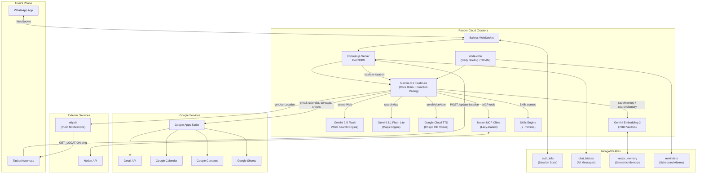
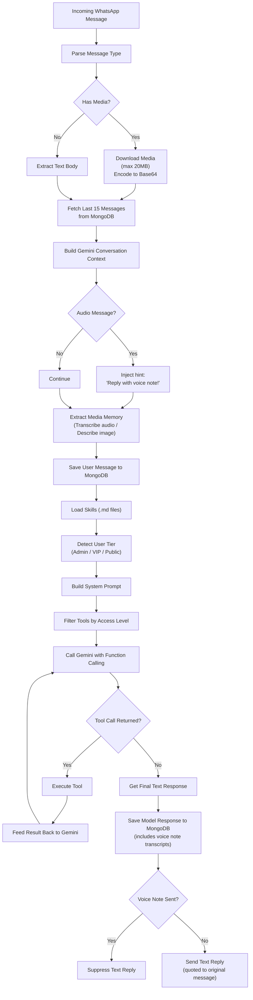
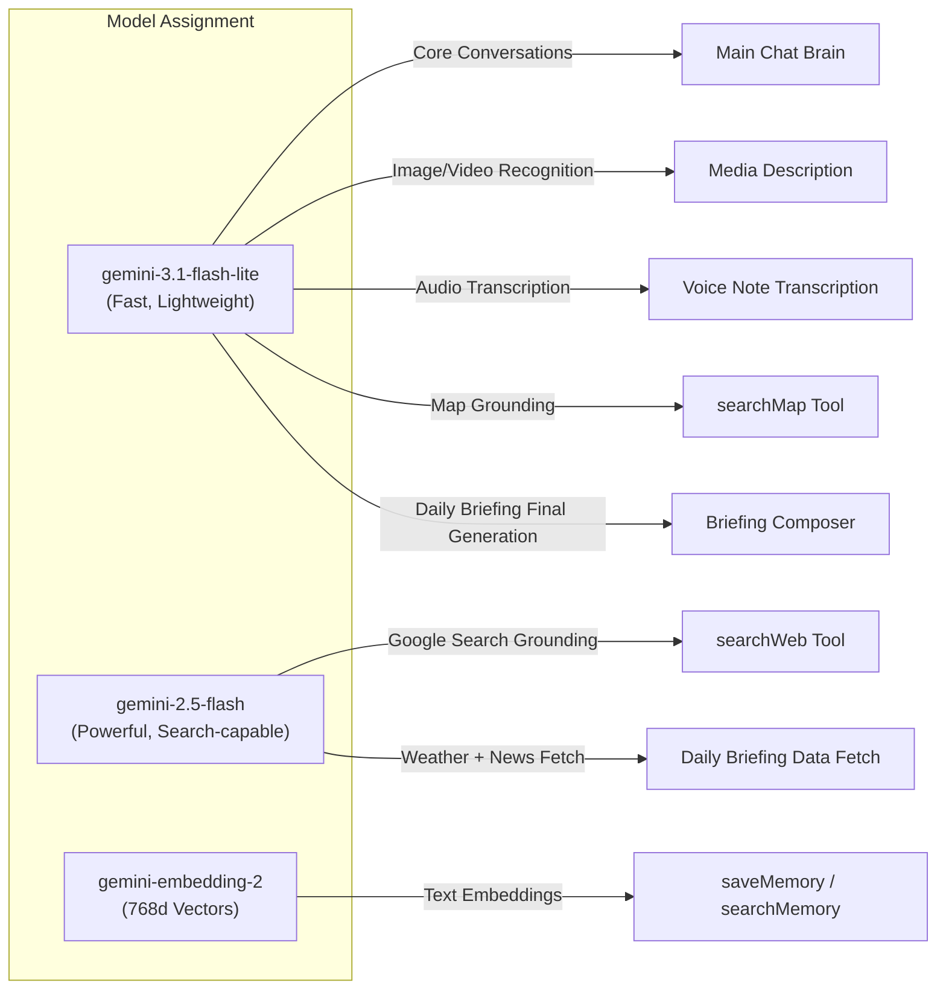
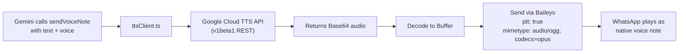
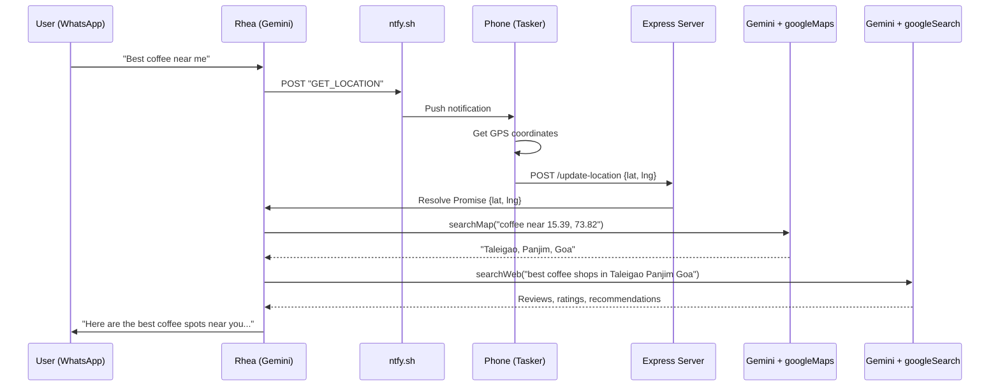
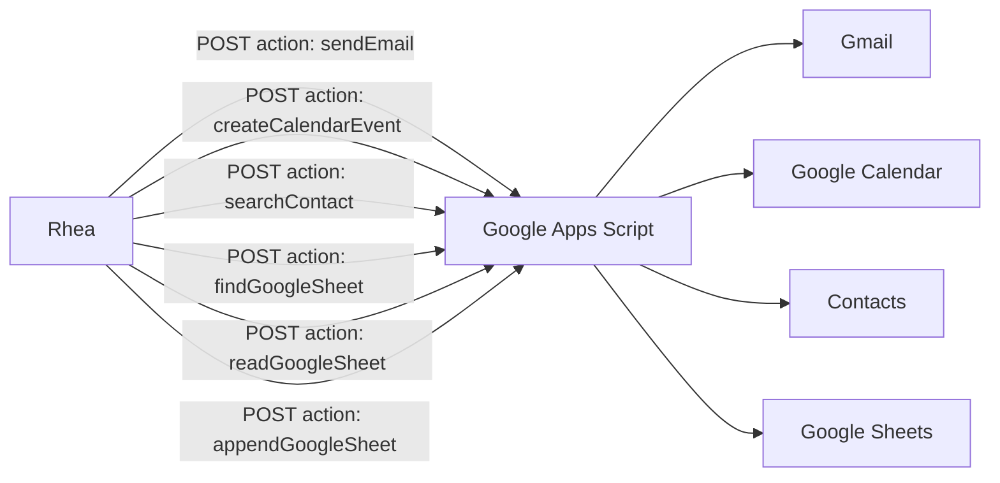

# Rhea — WhatsApp AI Avatar & Personal Assistant

> *A multi-model AI-powered WhatsApp bot that acts as a personal avatar and assistant for Yatin, built with TypeScript, Baileys, Google Gemini, and MongoDB.*

---

## Table of Contents

1. [Project Overview](#1-project-overview)
2. [Tech Stack & Dependencies](#2-tech-stack--dependencies)
3. [Architecture Diagram](#3-architecture-diagram)
4. [Project File Structure](#4-project-file-structure)
5. [Environment Variables](#5-environment-variables)
6. [Setup & Deployment](#6-setup--deployment)
7. [Core System: How It Works](#7-core-system-how-it-works)
   - 7.1 [Boot Sequence](#71-boot-sequence)
   - 7.2 [WhatsApp Connection & Auth](#72-whatsapp-connection--auth)
   - 7.3 [Message Processing Pipeline](#73-message-processing-pipeline)
   - 7.4 [User Tier System (Admin / VIP / Public)](#74-user-tier-system-admin--vip--public)
   - 7.5 [System Prompts Per Tier](#75-system-prompts-per-tier)
   - 7.6 [Function Calling Loop](#76-function-calling-loop)
   - 7.7 [Response & History Saving](#77-response--history-saving)
8. [Multi-Model AI Architecture](#8-multi-model-ai-architecture)
9. [Complete Tool Reference](#9-complete-tool-reference)
10. [Feature Deep Dives](#10-feature-deep-dives)
    - 10.1 [Voice Notes (Google Cloud TTS)](#101-voice-notes-google-cloud-tts)
    - 10.2 [Location & Maps Pipeline](#102-location--maps-pipeline)
    - 10.3 [Web Search Engine](#103-web-search-engine)
    - 10.4 [Daily Morning Briefing](#104-daily-morning-briefing)
    - 10.5 [Vector Memory (Long-Term Memory)](#105-vector-memory-long-term-memory)
    - 10.6 [Media Processing & Memory Extraction](#106-media-processing--memory-extraction)
    - 10.7 [Reminders & Alarms](#107-reminders--alarms)
    - 10.8 [Google Suite Integration](#108-google-suite-integration)
    - 10.9 [Chat History System](#109-chat-history-system)
    - 10.10 [MCP / Notion Integration](#1010-mcp--notion-integration)
    - 10.11 [VIP Group Support](#1011-vip-group-support)
11. [Skills System](#11-skills-system)
12. [MongoDB Schema Reference](#12-mongodb-schema-reference)
13. [Express API Endpoints](#13-express-api-endpoints)
14. [Deployment on Render](#14-deployment-on-render)
15. [Development History](#15-development-history)

---

## 1. Project Overview

**Rhea** is a fully autonomous WhatsApp AI assistant deployed on [Render](https://render.com). It functions as a personal AI avatar for its creator, Yatin, while also serving his family (VIPs) and the general public with varying levels of access.

| Property | Value |
|---|---|
| **Repository** | [YatinMurkar/whatsappapi](https://github.com/YatinMurkar/whatsappapi) |
| **Language** | TypeScript |
| **Main File** | [index.ts](file:///d:/whatsappapi-master/index.ts) (~1,850 lines) |
| **Hosting** | Render (Free Tier, Docker) |
| **Live URL** | `https://whatsappapi-kxe0.onrender.com` |
| **Owner WhatsApp** | `+91 93732 78178` |

### What Can Rhea Do?

- **Conversational AI** — Natural Minglish (Marathi + English) conversations
- **Voice Notes** — Generates and sends synthesized voice messages (Google Cloud TTS)
- **Web Search** — Live internet search with Google Search grounding
- **Maps & Location** — Real-time GPS location, traffic, nearby places
- **Daily Briefing** — Automated 7:30 AM IST briefing with weather, news, reminders
- **Long-Term Memory** — Semantic vector memory that persists across conversations
- **Email** — Send emails via Gmail
- **Calendar** — Create Google Calendar events
- **Google Sheets** — Full CRUD operations on spreadsheets
- **Contacts** — Search Google Contacts by name
- **Reminders & Alarms** — Schedule, list, and manage timed reminders
- **Chat History** — Read past conversations with any contact
- **Notion** — Read/write Notion pages and databases via MCP
- **Media Understanding** — Process images, videos, audio, documents with AI descriptions
- **WhatsApp Messaging** — Send messages to any contact on behalf of Yatin

---

## 2. Tech Stack & Dependencies

### Core Runtime

| Technology | Purpose |
|---|---|
| **TypeScript** | Primary language (compiled with `ts-node --transpile-only`) |
| **Node.js 20** | Runtime (Docker image: `node:20-slim`) |
| **Express.js 5** | HTTP server for API endpoints, QR code UI, location webhook |
| **Baileys** (`@whiskeysockets/baileys`) | Unofficial WhatsApp Web API (lightweight, no Chromium) |

### AI & ML

| Technology | Purpose |
|---|---|
| **Google Gemini 3.1 Flash Lite** | Core conversational brain, image recognition, map grounding |
| **Google Gemini 2.5 Flash** | Web search engine (Google Search grounding) |
| **Google Gemini Embedding-2** | 768-dimensional text embeddings for vector memory |
| **Google Cloud TTS v1beta1** | Voice note synthesis (Chirp3 HD voices, OGG_OPUS output) |

### Data & Storage

| Technology | Purpose |
|---|---|
| **MongoDB Atlas** | Auth state, chat history, reminders, vector memory |
| **MongoDB `$vectorSearch`** | Semantic similarity search on memory embeddings |

### Integrations

| Technology | Purpose |
|---|---|
| **Google Apps Script** | Serverless bridge for Gmail, Calendar, Contacts, Sheets |
| **Notion MCP Server** | Model Context Protocol integration for Notion workspace |
| **ntfy.sh** | Push notification service for phone GPS pinging |
| **Tasker/Automate** | Android app that responds to ntfy pings with GPS coordinates |

### All npm Dependencies

| Package | Version | Purpose |
|---|---|---|
| `@google/genai` | ^2.8.0 | Gemini AI SDK for function calling, embeddings, grounding |
| `@modelcontextprotocol/sdk` | ^1.29.0 | MCP protocol client |
| `@notionhq/notion-mcp-server` | ^2.2.1 | Notion MCP server binary |
| `@whiskeysockets/baileys` | ^7.0.0-rc13 | WhatsApp Web multi-device API |
| `axios` | ^1.12.2 | HTTP client for TTS, Apps Script, ntfy |
| `dotenv` | ^17.4.2 | Environment variable loader |
| `express` | ^5.1.0 | HTTP server |
| `mongoose` | ^9.7.0 | Listed but unused (raw MongoDB driver used instead) |
| `node-cron` | ^4.2.1 | Cron scheduling for daily briefing |
| `pino` | ^10.3.1 | Logger (set to `silent` for clean output) |
| `qrcode` | ^1.5.4 | QR code generation for web login UI |
| `ts-node` | Latest | TypeScript execution |
| `typescript` | Latest | TypeScript compiler |

---

## 3. Architecture Diagram



---

## 4. Project File Structure

```
d:\whatsappapi-master\
├── index.ts                 # Main bot brain (~1,850 lines)
├── mcpClient.ts             # MCP/Notion integration client (~168 lines)
├── ttsClient.ts             # Google Cloud TTS voice note generator (~51 lines)
├── package.json             # Dependencies & scripts
├── tsconfig.json            # TypeScript config (ES2018, CommonJS)
├── Dockerfile               # Docker containerization (node:20-slim)
├── .env                     # Environment variables (gitignored)
├── .env.example             # Template for environment variables
├── .gitignore               # Node modules, auth files, .env
├── skills/                  # AI instruction files (loaded at runtime)
│   ├── alarm.md             # Alarm & reminder usage instructions
│   ├── calendar.md          # Google Calendar skill
│   ├── email.md             # Email sending skill
│   ├── location_search.md   # Location, traffic & places workflow
│   ├── memory.md            # Vector memory usage rules
│   ├── messaging.md         # WhatsApp messaging & contact search
│   ├── reminders.md         # Reminder management instructions
│   ├── sheets.md            # Google Sheets CRUD skill
│   └── web_search.md        # Web search usage instructions
└── (generated at runtime)
    ├── index.js             # Compiled JavaScript output
    └── node_modules/        # Dependencies
```

---

## 5. Environment Variables

| Variable | Required | Description |
|---|---|---|
| `PORT` | Yes | Express server port (default: `3000`) |
| `MONGODB_URI` | Yes | MongoDB Atlas connection string |
| `GEMINI_API_KEY` | Yes | Google Gemini API key for AI |
| `GOOGLE_TTS_API_KEY` | Yes | Google Cloud TTS API key for voice notes |
| `NOTION_TOKEN` | No | Notion integration token for MCP tools |
| `APPS_SCRIPT_URL` | No | Google Apps Script web app URL for Gmail/Calendar/Sheets |
| `N8N_WEBHOOK_URL` | No | n8n webhook URL (legacy) |
| `ADMIN_NUMBERS` | No | Comma-separated admin phone numbers (default: Yatin's numbers) |
| `VIP_PAPPA` | No | Comma-separated Pappa's phone/LID numbers |
| `VIP_MAMMA` | No | Comma-separated Mamma's phone/LID numbers |
| `VIP_PRANJAL` | No | Comma-separated Pranjal's phone/LID numbers |
| `VIP_GROUPS` | No | Comma-separated VIP WhatsApp group JIDs |

---

## 6. Setup & Deployment

### Local Development

```bash
# 1. Clone the repository
git clone https://github.com/YatinMurkar/whatsappapi.git
cd whatsappapi

# 2. Install dependencies
npm install

# 3. Create .env file with required variables
cp .env.example .env
# Edit .env with your credentials

# 4. Run the bot
npm test
# This runs: npx ts-node --transpile-only index.ts

# 5. Scan QR code
# Visit http://localhost:3000/qr in your browser
# Scan with WhatsApp > Linked Devices > Link a Device
```

### Docker

```dockerfile
FROM node:20-slim
WORKDIR /app
COPY package*.json tsconfig.json ./
RUN npm install
COPY . .
EXPOSE 3000
CMD ["npx", "ts-node", "--transpile-only", "index.ts"]
```

### Render Deployment

1. Push code to GitHub
2. Create a **Web Service** on Render connected to the repo
3. Set **Environment** to `Docker`
4. Add all environment variables in Render dashboard
5. Auto-deploy is enabled on `master` branch commits
6. The bot uses a `/ping` endpoint for Cloudflare Worker keepalive to prevent free-tier sleep

---

## 7. Core System: How It Works

### 7.1 Boot Sequence

When the bot starts ([index.ts](file:///d:/whatsappapi-master/index.ts)), it performs these steps in order:

1. **Load environment variables** via `dotenv`
2. **Initialize Google Gemini AI** client with `GEMINI_API_KEY`
3. **Start Express server** on configured `PORT`
4. **Connect to MongoDB Atlas** and get collection handles for:
   - `auth_info` — Baileys session state
   - `chat_history` — Conversation logs
   - `vector_memory` — Semantic long-term memory
   - `reminders` — Scheduled alarms
5. **Initialize MCP Tools** — Spins up Notion MCP server, fetches tool schemas, caches them, kills the server immediately to save RAM
6. **Create Baileys WhatsApp socket** with:
   - `fetchLatestBaileysVersion()` for protocol compatibility
   - `Browsers.macOS("Desktop")` fingerprint
   - `pino({ level: 'silent' })` logger
   - Custom MongoDB auth state
7. **Register event listeners:**
   - `creds.update` → save credentials to MongoDB
   - `connection.update` → handle QR codes, disconnects, reconnects
   - `messages.upsert` → process incoming messages (the main logic)
8. **Start Reminder Cron** — 60-second `setInterval` loop that checks MongoDB for due reminders
9. **Start Daily Briefing Cron** — `node-cron` job at `'30 7 * * *'` (7:30 AM IST)

### 7.2 WhatsApp Connection & Auth

Baileys connects to WhatsApp's multi-device servers via WebSocket. Authentication state is persisted in MongoDB using a custom `useMongoDBAuthState()` function:

```
MongoDB Collection: auth_info
├── Document: { _id: "creds", value: "{...serialized credentials...}" }
├── Document: { _id: "app-state-sync-key-XXXX", value: "..." }
├── Document: { _id: "sender-key-XXXX", value: "..." }
└── ... (various session keys)
```

- Uses `BufferJSON.replacer/reviver` for proper Buffer serialization
- On connection close: auto-reconnects unless status is `loggedOut` (in which case, deletes all session data and restarts fresh)
- QR code is displayed on the `/qr` web endpoint for initial pairing

### 7.3 Message Processing Pipeline

Every incoming WhatsApp message goes through this pipeline:



**Supported Message Types:**
- `conversation` — Plain text
- `extendedTextMessage` — Text with links/formatting
- `imageMessage` — Photos
- `videoMessage` — Videos
- `audioMessage` — Voice notes / audio files
- `documentMessage` — PDFs, documents
- `stickerMessage` — Stickers

### 7.4 User Tier System (Admin / VIP / Public)

Rhea has a 3-tier access control system:

#### Admin (Full Access)
- **Identification:** Phone number matches `ADMIN_NUMBERS` env var
- **Default Admin:** `919373278178` (Yatin), plus two LID variants
- **Access:** All 21+ native tools + all MCP/Notion tools

#### VIP (Priority Access)
- **Identification:** Phone number matches VIP lists OR `remoteJid` matches VIP group
- **VIP Members:**

| Person | Phone Numbers | LID Numbers |
|---|---|---|
| Pappa | `919561892366` | `149469156921474` |
| Mamma | `919324404314` | `241510339620878` |
| Pranjal | `917744845094`, `917821813356` | `40789321191437` |
| VIP Group | — | `120363409001747998@g.us` |

- **Access:** `setReminder`, `listReminders`, `deleteReminder`, `sendVoiceNote`, `messageAdmin`, `searchWeb`, `searchMap`, `getUserLocation`

> [!NOTE]
> **Why LID Numbers?** WhatsApp Multi-Device uses Local ID (LID) numbers internally. The same person may appear as different numbers depending on the device routing. Both phone numbers and LIDs are checked for VIP matching.

#### Public (Basic Access)
- **Identification:** Anyone not matching Admin or VIP lists
- **Access:** `setReminder`, `listReminders`, `deleteReminder` only

### 7.5 System Prompts Per Tier

Each tier gets a different system prompt injected into Gemini:

| Tier | Persona | Key Instructions |
|---|---|---|
| **Admin** | "You are Rhea, an AI avatar of Yatin. You are talking directly to Yatin." | Knows all VIP JIDs hardcoded. Has tool hallucination prevention rules. Full skills context. |
| **VIP** | "You are Rhea, an AI avatar of Yatin. You are talking to [VIP Name]. This is Yatin's inner VIP circle." | Warmth and priority. Limited tools. Skills context included. |
| **Public** | "You are Yatin's Virtual Assistant. You do NOT have access to Yatin's personal data." | Minimal permissions. Professional tone. |

**Common Rules Across All Tiers:**
- WhatsApp formatting: single asterisks for bold (`*text*`), never double (`**text**`)
- Never use em-dash (`—`) character
- Current IST time injected dynamically
- Must actually call tools, never hallucinate actions

### 7.6 Function Calling Loop

Gemini's response may contain tool calls. The bot runs a loop (max 5 iterations):

```
1. Send message + tools to Gemini
2. If Gemini returns a function_call:
   a. Execute the tool
   b. Feed the result back as a function_response
   c. Go to step 1 (let Gemini call another tool or generate text)
3. If Gemini returns text: exit loop, use as final response
```

This allows multi-step reasoning. For example, a "best coffee near me" query triggers:
1. `getUserLocation` → returns GPS coords
2. `searchMap` → converts coords to area name
3. `searchWeb` → searches for best coffee shops in that area

### 7.7 Response & History Saving

After the function-calling loop completes:

1. **Final text** is extracted from Gemini's response
2. **Voice note transcript** is prepended if a voice note was sent:
   ```
   [Rhea Voice Note Transcript: "Hey! Main theek aahe, tu kasa aahe?"] I'm doing great!
   ```
3. **Saved to MongoDB** `chat_history` with `role: "model"`, `content`, `timestamp`
4. **Sent to WhatsApp** — quoted to the original message — **unless** a voice note was already sent (to avoid duplicate responses)

---

## 8. Multi-Model AI Architecture

Rhea uses a deliberate multi-model strategy where each Gemini model is chosen for its specific strengths:



| Model | Use Case | Why This Model? |
|---|---|---|
| `gemini-3.1-flash-lite` | Core brain, media, maps | Ultra-fast, low-latency, sufficient for conversation |
| `gemini-2.5-flash` | Web search, briefing data | Supports Google Search grounding tool |
| `gemini-embedding-2` | Vector memory | 768-dimensional embeddings for semantic search |

---

## 9. Complete Tool Reference

### Tool Access Matrix

| # | Tool | Description | Admin | VIP | Public |
|---|---|---|---|---|---|
| 1 | `sendVoiceNote` | Send synthesized voice message | ✅ | ✅ | ❌ |
| 2 | `setReminder` | Schedule a timed reminder | ✅ | ✅ | ✅ |
| 3 | `listReminders` | View all active reminders | ✅ | ✅ | ✅ |
| 4 | `deleteReminder` | Cancel a reminder by ID | ✅ | ✅ | ✅ |
| 5 | `searchWeb` | Live Google Search | ✅ | ✅ | ❌ |
| 6 | `searchMap` | Google Maps search | ✅ | ✅ | ❌ |
| 7 | `getUserLocation` | Ping phone for GPS coordinates | ✅ | ✅ | ❌ |
| 8 | `messageAdmin` | Send message/voice to Yatin | ❌ | ✅ | ❌ |
| 9 | `sendEmail` | Send email via Gmail | ✅ | ❌ | ❌ |
| 10 | `createCalendarEvent` | Create Google Calendar event | ✅ | ❌ | ❌ |
| 11 | `searchGoogleContact` | Search Google Contacts | ✅ | ❌ | ❌ |
| 12 | `sendWhatsAppMessage` | Send WhatsApp message to anyone | ✅ | ❌ | ❌ |
| 13 | `findGoogleSheet` | Search Google Drive for sheets | ✅ | ❌ | ❌ |
| 14 | `createGoogleSheet` | Create new spreadsheet | ✅ | ❌ | ❌ |
| 15 | `readGoogleSheet` | Read data from spreadsheet | ✅ | ❌ | ❌ |
| 16 | `appendGoogleSheet` | Append rows to spreadsheet | ✅ | ❌ | ❌ |
| 17 | `updateGoogleSheet` | Overwrite cells in spreadsheet | ✅ | ❌ | ❌ |
| 18 | `saveMemory` | Save fact to vector memory | ✅ | ❌ | ❌ |
| 19 | `searchMemory` | Search vector memory semantically | ✅ | ❌ | ❌ |
| 20 | `triggerDailyBriefing` | Manually trigger morning briefing | ✅ | ❌ | ❌ |
| 21 | `readChatHistory` | Read past messages with a contact | ✅ | ❌ | ❌ |
| — | *MCP/Notion tools* | *Dynamically loaded Notion tools* | ✅ | ❌ | ❌ |

### Tool Parameters Reference

#### `sendVoiceNote`
| Parameter | Type | Required | Description |
|---|---|---|---|
| `text` | string | Yes | The text to speak out loud |
| `languageCode` | string | No | Must be `ar-XA` (Chirp3 HD auto-detects language) |
| `voiceName` | string | No | `ar-XA-Chirp3-HD-Kore` (female) or `ar-XA-Chirp3-HD-Umbriel` (male) |
| `targetPhoneNumber` | string | No | Send to a different person (10-digit adds `91` prefix) |

#### `setReminder`
| Parameter | Type | Required | Description |
|---|---|---|---|
| `minutes` | number | Yes | Minutes from now to trigger |
| `message` | string | Yes | Reminder message text |
| `targetPhoneNumber` | string | No | Set reminder for someone else |

#### `searchWeb`
| Parameter | Type | Required | Description |
|---|---|---|---|
| `query` | string | Yes | Google-friendly search query |

#### `searchMap`
| Parameter | Type | Required | Description |
|---|---|---|---|
| `query` | string | Yes | Map query (e.g., "Coffee shops near 15.39, 73.82") |

#### `readChatHistory`
| Parameter | Type | Required | Description |
|---|---|---|---|
| `targetJid` | string | Yes | WhatsApp JID to read history for |
| `limit` | number | No | Max messages to return (default: 20) |

#### `messageAdmin`
| Parameter | Type | Required | Description |
|---|---|---|---|
| `content` | string | Yes | Message content to send to Yatin |
| `type` | string | No | `text` or `audio` (voice note) |
| `voiceName` | string | No | Voice for audio type |

#### `saveMemory`
| Parameter | Type | Required | Description |
|---|---|---|---|
| `fact` | string | Yes | The fact to permanently store |

#### `searchMemory`
| Parameter | Type | Required | Description |
|---|---|---|---|
| `query` | string | Yes | Natural language search query |

#### Google Suite Tools
All Google Suite tools (`sendEmail`, `createCalendarEvent`, `searchGoogleContact`, Google Sheets tools) communicate with a Google Apps Script web app via HTTP POST. Parameters match their respective Google API fields.

---

## 10. Feature Deep Dives

### 10.1 Voice Notes (Google Cloud TTS)

**File:** [ttsClient.ts](file:///d:/whatsappapi-master/ttsClient.ts)

Rhea can speak! The voice note pipeline:



**Key Implementation Details:**
- Uses the **v1beta1 REST API** directly via Axios (avoids heavy `@google-cloud/text-to-speech` SDK)
- Output format: `OGG_OPUS` — this is WhatsApp's native voice note format, so **no FFmpeg conversion needed**
- Default voice: `ar-XA-Chirp3-HD-Kore` (female) — uses Arabic locale code, but Chirp3 HD auto-detects the actual language from the text content
- Male voice: `ar-XA-Chirp3-HD-Umbriel`
- Sent as Push-to-Talk (`ptt: true`) so WhatsApp renders it as a voice note bubble, not an audio file

**Voice Note Memory:** When Rhea sends a voice note, the text script is captured and saved to MongoDB:
```
[Rhea Voice Note Transcript: "actual spoken text here"]
```
This ensures Rhea remembers what it said out loud.

**Incoming Voice Note Transcription:** When a user sends a voice note, Gemini transcribes it word-for-word and saves:
```
[User Voice Note Transcript: "exact words spoken"]
```

### 10.2 Location & Maps Pipeline

**Skill File:** [location_search.md](file:///d:/whatsappapi-master/skills/location_search.md)

This is a multi-step pipeline that uses the phone's actual GPS:

#### "Best coffee near me" Flow (3 steps):



#### "Traffic to airport" Flow (2 steps):

1. `getUserLocation` → Get GPS coords
2. `searchMap` → "Traffic from [coords] to Dabolim Airport Goa"

> [!IMPORTANT]
> The skill instructions explicitly state: **Never pass raw GPS coordinates to `searchWeb`**. Always use `searchMap` first to resolve coordinates to a human-readable location name.

### 10.3 Web Search Engine

**Skill File:** [web_search.md](file:///d:/whatsappapi-master/skills/web_search.md)

Uses Gemini 2.5 Flash with Google's built-in **Search Grounding** tool — no external API keys needed for search:

```typescript
const searchResponse = await ai.models.generateContent({
    model: 'gemini-2.5-flash',
    contents: [{ role: 'user', parts: [{ text: query }] }],
    config: { tools: [{ googleSearch: {} }] }
});
```

This gives Rhea access to live Google Search results, current prices, news, weather, sports scores, and any real-time information.

### 10.4 Daily Morning Briefing

**Schedule:** `'30 7 * * *'` — 7:30 AM IST daily (via `node-cron`)

**4-Step Pipeline:**

| Step | Model | Tool | Purpose |
|---|---|---|---|
| 1 | — | ntfy.sh ping | Get user's current GPS location |
| 2 | `gemini-3.1-flash-lite` | `googleMaps` | Convert lat/lng → city name |
| 3 | `gemini-2.5-flash` | `googleSearch` | Fetch weather + 3 top news headlines for that city |
| 4 | `gemini-3.1-flash-lite` | — | Compose final briefing with emojis, weather, news, and pending reminders |

**Output Example:**
```
☀️ *Good Morning Yatin!*

🌡️ Weather in Panjim, Goa:
Partly cloudy, 28°C, humidity 78%

📰 Top Headlines:
1. India beats Australia in 3rd Test...
2. Goa tourism revenue hits record...
3. New highway bypass opens near...

⏰ Reminders for today:
- Meeting with Raj at 11 AM
- Pick up groceries
```

### 10.5 Vector Memory (Long-Term Memory)

**Skill File:** [memory.md](file:///d:/whatsappapi-master/skills/memory.md)

Rhea has a persistent semantic memory system using vector embeddings:

#### Saving a Memory
```
User: "Remember that my favorite biryani is from A1 Caterers in Taleigao"
```
1. Gemini calls `saveMemory(fact: "Yatin's favorite biryani is from A1 Caterers in Taleigao")`
2. Text is converted to a 768-dimensional vector using `gemini-embedding-2`
3. Stored in MongoDB `vector_memory` collection with `{text, embedding[], createdAt}`

#### Searching Memory
```
User: "Where do I usually order biryani from?"
```
1. Gemini calls `searchMemory(query: "biryani order")`
2. Query is embedded using `gemini-embedding-2`
3. MongoDB `$vectorSearch` aggregation pipeline finds top 3 semantically similar facts
4. Results returned to Gemini for natural language response

> [!NOTE]
> **Explicit Memory Rule:** The skill instructions specify that Rhea should only save *persistent facts* (preferences, passwords, relationships) — NOT casual conversation. It should also never randomly bring up saved memories unless the user explicitly asks.

### 10.6 Media Processing & Memory Extraction

When a user sends media (image, video, audio, document):

1. **Download** via Baileys `downloadMediaMessage()` (max 20MB)
2. **Encode** to Base64 string
3. **Send to Gemini** as `inlineData` with the original MIME type
4. **Extract Memory:**
   - **Images/Videos:** "Describe what is in this media file in one concise sentence"
   - **Audio:** "Please transcribe this audio message exactly word-for-word"
5. **Save to MongoDB** as text description (binary data is NOT stored to save space):
   ```
   [Media attached: "A photo of a sunset over the ocean"] user's caption text
   [User Voice Note Transcript: "Mala ek coffee havi"] user's caption text
   ```

### 10.7 Reminders & Alarms

**Skill Files:** [reminders.md](file:///d:/whatsappapi-master/skills/reminders.md), [alarm.md](file:///d:/whatsappapi-master/skills/alarm.md)

**Setting a Reminder:**
1. User says "Remind me in 30 minutes to call Pranjal"
2. Gemini calls `setReminder(minutes: 30, message: "Call Pranjal")`
3. Calculates `triggerTime = Date.now() + (30 * 60000)`
4. Stores in MongoDB `reminders` collection

**Checking Reminders:**
- A 60-second `setInterval` loop runs continuously
- Queries MongoDB for reminders where `triggerTime <= Date.now()`
- Fires each due reminder as a WhatsApp message to the target JID
- Deletes the reminder after firing

**Cross-User Reminders:**
- Admin can set reminders for other people using `targetPhoneNumber`
- Uses `searchGoogleContact` to find numbers by name

### 10.8 Google Suite Integration

All Google services are integrated through a single **Google Apps Script** web app that acts as a serverless API router:



> [!TIP]
> **Why Apps Script instead of OAuth?** Apps Script runs under Yatin's Google account natively — no OAuth flow, no service accounts, no token refresh. One `doPost(e)` function handles all actions. Simple and reliable.

### 10.9 Chat History System

Every message (both user and model) is saved to MongoDB `chat_history`:

**User Messages:**
```json
{
    "remoteJid": "917744845094@s.whatsapp.net",
    "role": "user",
    "content": "[Media attached: A selfie of a girl smiling] Look at this!",
    "timestamp": "2026-06-15T10:30:00Z"
}
```

**Model Responses:**
```json
{
    "remoteJid": "917744845094@s.whatsapp.net",
    "role": "model",
    "content": "[Rhea Voice Note Transcript: \"Kitna sundar photo hai!\"] That's a great photo!",
    "timestamp": "2026-06-15T10:30:05Z"
}
```

**Context Window:** Last 15 messages are fetched for each conversation to maintain context.

**JID-to-LID Mapping:** The `readChatHistory` tool includes hardcoded mappings for WhatsApp Multi-Device LID resolution:
| Phone JID | Maps To LID |
|---|---|
| `917744845094` (Pranjal) | `40789321191437@lid` |
| `919373278178` (Yatin) | `122423764594882@lid` |
| `919324404314` (Mamma) | `241510339620878@lid` |

### 10.10 MCP / Notion Integration

**File:** [mcpClient.ts](file:///d:/whatsappapi-master/mcpClient.ts)

Uses the Model Context Protocol to integrate with Notion:

**Architecture: Lazy-Loading Pattern**

To save RAM on cloud hosting, the Notion MCP server is NOT kept running:

1. **On Boot (`initializeMcpTools`):**
   - Starts Notion MCP server via `StdioClientTransport`
   - Fetches all tool schemas
   - Resolves `$ref/$defs` in JSON Schema (Gemini doesn't support them)
   - Sanitizes `anyOf/oneOf/allOf` union types
   - Caches tool declarations in memory
   - **Immediately kills the server** to free RAM

2. **On Tool Call (`executeMcpTool`):**
   - Starts server fresh
   - Executes the specific tool
   - Gets result
   - **Immediately kills the server again**

3. **`getMcpToolsCache`:** Returns cached declarations (no server needed)

> [!NOTE]
> MCP tools are only available to Admin users. They are dynamically merged into the tool declarations at runtime.

### 10.11 VIP Group Support

The group "We 3 soon to be 4...⚡" (`120363409001747998@g.us`) is treated as a VIP entity. When messages come from this group:

- `remoteJid` is checked against `VIP_GROUPS` env var
- VIP name is set to `"Yatin & Pranjal (VIP Group: We 3 soon to be 4...⚡)"`
- System prompt acknowledges the inner circle group context
- Full VIP tool access is granted (voice notes, search, maps, etc.)

---

## 11. Skills System

Skills are `.md` instruction files loaded at runtime from the `skills/` directory. They are concatenated and injected into the system prompt, giving Gemini specific instructions for how to use each tool.

| Skill File | Purpose | Key Instructions |
|---|---|---|
| [alarm.md](file:///d:/whatsappapi-master/skills/alarm.md) | Alarm & reminder usage | Calculate minutes from NOW, confirm after setting |
| [calendar.md](file:///d:/whatsappapi-master/skills/calendar.md) | Calendar events | Parse natural dates → ISO 8601, default 1-hour duration |
| [email.md](file:///d:/whatsappapi-master/skills/email.md) | Email sending | Keep writing natural, ask for email if not provided |
| [location_search.md](file:///d:/whatsappapi-master/skills/location_search.md) | Location workflow | 3-step pipeline: GPS → Map → Web. Never skip `getUserLocation` |
| [memory.md](file:///d:/whatsappapi-master/skills/memory.md) | Vector memory rules | Only save persistent facts, don't randomly recall memories |
| [messaging.md](file:///d:/whatsappapi-master/skills/messaging.md) | WhatsApp messaging | Use `searchGoogleContact` before `sendWhatsAppMessage` |
| [reminders.md](file:///d:/whatsappapi-master/skills/reminders.md) | Reminder management | View → list, Cancel → list+delete, Change → delete+set |
| [sheets.md](file:///d:/whatsappapi-master/skills/sheets.md) | Google Sheets CRUD | Always use `findGoogleSheet` instead of asking for URL |
| [web_search.md](file:///d:/whatsappapi-master/skills/web_search.md) | Web search | Keep queries concise, never hallucinate live data |

---

## 12. MongoDB Schema Reference

### Database: `whatsapp_bot`

#### Collection: `auth_info`
```json
{
    "_id": "creds",
    "value": "{...serialized Baileys credentials with BufferJSON...}"
}
```

#### Collection: `chat_history`
```json
{
    "_id": ObjectId("..."),
    "remoteJid": "917744845094@s.whatsapp.net",
    "role": "user" | "model",
    "content": "Hello! How are you?",
    "timestamp": ISODate("2026-06-15T10:30:00Z")
}
```

#### Collection: `vector_memory`
```json
{
    "_id": ObjectId("..."),
    "text": "Yatin's favorite biryani is from A1 Caterers in Taleigao",
    "embedding": [0.0234, -0.0567, ...],  // 768 dimensions
    "createdAt": ISODate("2026-06-14T10:00:00Z")
}
```
> Requires a MongoDB Atlas **Vector Search Index** named `vector_index` on the `embedding` field.

#### Collection: `reminders`
```json
{
    "_id": ObjectId("..."),
    "creatorJid": "919373278178@s.whatsapp.net",
    "remoteJid": "917744845094@s.whatsapp.net",
    "message": "Call Pranjal",
    "triggerTime": 1718454600000
}
```

---

## 13. Express API Endpoints

| Endpoint | Method | Purpose | Auth |
|---|---|---|---|
| `/ping` | GET | Health check / keepalive for Cloudflare Worker | None |
| `/qr` | GET | Web page displaying QR code for WhatsApp pairing | None |
| `/send-message` | POST | Send text message to any WhatsApp number | None |
| `/send-media` | POST | Send media (image/video/audio/document) | None |
| `/react-to-message` | POST | React to a message with emoji | None |
| `/add-to-group` | POST | Add participant to WhatsApp group | None |
| `/search-chat` | POST | Returns 501 (not implemented) | None |
| `/update-location` | POST | Receives GPS coordinates from phone | None |

> [!WARNING]
> These endpoints currently have no authentication. They are designed for internal use only (the phone's Tasker app and keepalive workers). In production, consider adding API key authentication.

---

## 14. Deployment on Render

### Current Deployment

| Property | Value |
|---|---|
| **Service Name** | `whatsappapi` |
| **Service ID** | `srv-d8mmi037uimc739354sg` |
| **URL** | `https://whatsappapi-kxe0.onrender.com` |
| **Plan** | Free |
| **Runtime** | Docker |
| **Region** | Oregon |
| **Auto-Deploy** | Yes (on `master` branch commits) |
| **Branch** | `master` |

### Keepalive Strategy

Render's free tier suspends services after 15 minutes of inactivity. A **Cloudflare Worker** pings the `/ping` endpoint every 14 minutes to prevent suspension.

### Deployment Flow

```
git push origin master
    → GitHub receives commit
    → Render detects new commit (auto-deploy)
    → Docker build starts
    → Container deployed
    → Bot connects to WhatsApp
```

---

## 15. Development History

### Phase 0: Foundation (June 12-13, 2026)
- Started with `whatsapp-web.js` (Puppeteer-based) + `LocalAuth`
- Initial Gemini model: `gemini-1.5-flash`
- TypeScript target was `ES5` → caused errors with optional chaining → fixed to `ES2018`

### Phase 1: Cloud Deployment Battle (June 13)
- Migrated from `LocalAuth` to `RemoteAuth` with MongoDB for cloud persistence
- **QR Code Loop Bug:** `backupSyncIntervalMs` set too low (30s) → crashed. Minimum is 60s
- Render's ephemeral storage kept losing sessions → MongoDB auth state solved this

### Phase 2: Library Pivot (June 13)
- **Abandoned `whatsapp-web.js`** — too heavy for Render's 512MB RAM free tier (needs Chromium/Puppeteer)
- **Migrated to Baileys** — lightweight, no browser needed, perfect for containers
- Implemented custom `useMongoDBAuthState()` function

### Phase 3: Model Evolution (June 13-14)
- `gemini-1.5-flash` → 404 (deprecated)
- `gemini-2.5-flash` → worked but too powerful for simple chat
- `gemini-3.5-flash` → 429 quota errors (20 free RPD limit)
- **Settled on `gemini-3.1-flash-lite`** for core brain (fast, cheap, sufficient)
- **`gemini-2.5-flash`** reserved for search grounding only

### Phase 4-5: Google Suite (June 13-14)
- Email via Apps Script → tested and working
- Calendar integration → same Apps Script pattern
- Created skill files for each

### Phase 6: Reminders System (June 14)
- MongoDB-based reminder storage
- 60-second polling loop
- Cross-user reminder support via `targetPhoneNumber`

### Phase 7: Vector Memory (June 14)
- Gemini Embedding-2 integration
- MongoDB `$vectorSearch` for semantic recall
- Bug: AI hallucinated saving memories → fixed with explicit tool usage rules

### Phase 8: Search & Maps (June 14)
- Initially planned DuckDuckGo scraping → pivoted to Gemini's built-in grounding
- `searchWeb` uses `googleSearch` tool, `searchMap` uses `googleMaps` tool
- GPS location via ntfy.sh → Tasker → `/update-location` webhook

### Phase 9: Voice Notes (June 15)
- Integrated Google Cloud TTS (v1beta1 REST API)
- Chirp3 HD voices with OGG_OPUS output
- Auto-voice-reply when user sends audio
- Voice note transcript memory system

### Phase 10: VIP System (June 15)
- 3-tier access control (Admin/VIP/Public)
- VIP identification by phone number + LID
- VIP Group support for family group chat
- `messageAdmin` tool for VIPs to reach Yatin

### Phase 11: Chat History & Memory (June 15)
- JID-to-LID mapping for Multi-Device compatibility
- Media memory extraction (describe images, transcribe audio)
- Binary media stripped before MongoDB storage

### Phase 12: MCP Integration (June 15)
- Notion MCP client with lazy-loading pattern
- JSON Schema `$ref` resolver for Gemini compatibility
- Kill-after-use strategy to conserve RAM

### Phase 13: Daily Briefing (June 15)
- 4-step multi-model pipeline
- Scheduled at 7:30 AM IST via node-cron
- Location-aware weather and news

### Phase 14: VIP Group Upgrade (June 16)
- Added "We 3 soon to be 4...⚡" group as VIP entity
- Full tool access (voice, search, maps) in group context

---

> [!TIP]
> **Total Lines of Code:** ~2,070 across 3 TypeScript files + 9 skill files
> **Total Tools:** 21+ native + dynamic MCP tools
> **Total MongoDB Collections:** 4
> **Models Used:** 3 (gemini-3.1-flash-lite, gemini-2.5-flash, gemini-embedding-2)
> **External Integrations:** 7 (WhatsApp, Google AI, Google TTS, Google Apps Script, MongoDB, Notion, ntfy.sh)

---

*Built with ❤️ by Yatin Murkar*
*Rhea v1.0 — June 2026*
